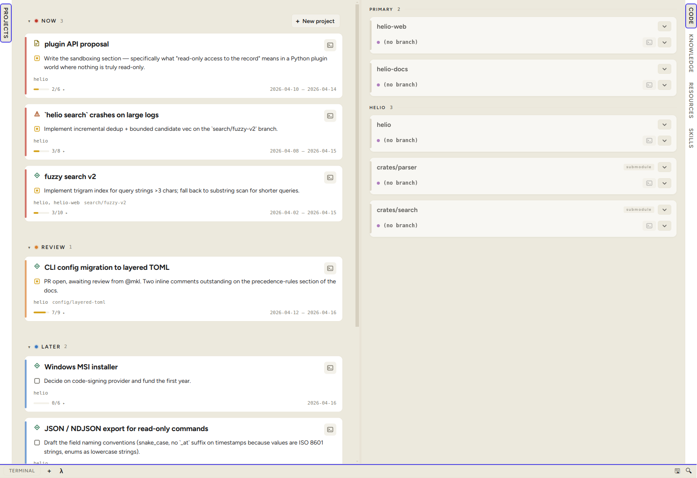

# condash

A desktop dashboard for a folder of Markdown files — **projects**, **incidents**, and **documents** kept as plain `.md` under `projects/YYYY-MM/YYYY-MM-DD-<slug>/README.md`. The files are the source of truth; condash is the live view on top.

## What it does

- Lists every project in your tree, grouped by status (Backlog → Next → Current → Done).
- Renders each project's README, notes, deliverables, and embedded PDFs in-place.
- Tracks the git state of any repos you've linked to a project, with one-click run / stop / open.
- Ships a built-in terminal and a knowledge-tree browser alongside the project pane.
- No server, no database, no account — your `.md` files stay yours.

## Documentation

Everything lives at **[condash.vcoeur.com](https://condash.vcoeur.com)**:

- [Get started](https://condash.vcoeur.com/get-started/) — install, first launch, releases.
- [Tutorials](https://condash.vcoeur.com/tutorials/) — first run, first project, a day with condash.
- [Reference](https://condash.vcoeur.com/reference/) — every CLI verb, config key, shortcut, mutation.
- [Background](https://condash.vcoeur.com/explanation/) — values, non-goals, internals, why Markdown-first.

The same pages are bundled inside the app under the **Help** menu.

## Contributing

Contributions are welcome. Start with [Contributing](https://condash.vcoeur.com/explanation/contributing/) for the clone → build → run → ship workflow, then skim [Values](https://condash.vcoeur.com/explanation/values/) and [Non-goals](https://condash.vcoeur.com/explanation/non-goals/) so a PR lands on the first try.

- Bugs and feature ideas → [issue tracker](https://github.com/vcoeur/condash/issues).
- Direct contact → **alice@vcoeur.com**.

## License

MIT.
